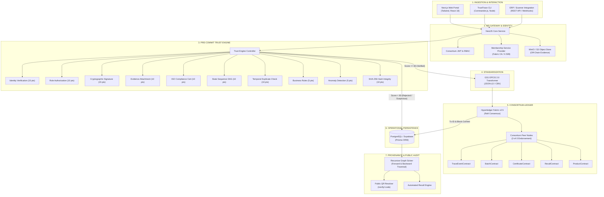
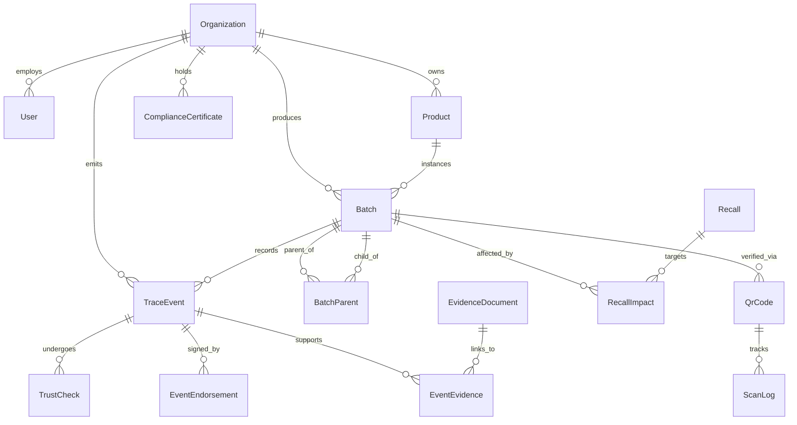

# TraceTrust: System Design & Architecture Specification

> **A Trust-First, Decentralized Provenance Architecture with Pre-Commit Verification, GS1 EPCIS 2.0 Standardization, and Permissioned Distributed Ledgers.**

---

## 1. Architectural Philosophy & Design Principles

TraceTrust is engineered to solve the foundational flaw of contemporary enterprise blockchains: **"Garbage In, Immutable Garbage Out"**. By anchoring unvetted physical claims directly to an immutable ledger, existing platforms only guarantee the immutability of fraud.

TraceTrust implements five architectural principles:

1. **Pre-Commit Trust Validation**: The distributed ledger is treated as a **consequence of verification, not the validator itself**. Data must pass an algorithmic gauntlet of 10 deterministic checks before invoking blockchain consensus.
2. **Decoupled Dual-State Persistence**:
   - **Operational State**: Ultra-fast relational and graph queries maintained in PostgreSQL / Supabase.
   - **Immutable State**: Cryptographic hashes, ownership transitions, and multi-party endorsements stored in Hyperledger Fabric.
3. **Privacy-Preserving Off-Chain Evidence**: Proprietary documents (invoices, pricing, lab certificates, bills of lading) remain off-chain in S3/MinIO. Only their canonical SHA-256 digests are anchored on-chain.
4. **GS1 EPCIS 2.0 Interoperability**: Every supply chain event conforms to GS1 EPCIS 2.0 JSON-LD standards with standardized Core Business Vocabulary (CBV).
5. **Multi-Party 2-of-3 Endorsements**: Critical custody handoffs require independent cryptographic signatures from both counter-parties and accredited inspection bodies.

---

## 2. End-to-End System Architecture

---

## 3. Layer-by-Layer Architectural Breakdown

### Layer 1: Ingestion & Client Interface
- **Next.js Web Portal (`apps/web`)**: Provides role-tailored dashboards for producers, manufacturers, logistics providers, retailers, auditors, and regulators.
- **Operator CLI (`apps/cli`)**: Terminal tool for field operators to log batch operations, scan QR tags, record transformation events, and execute provenance queries in low-bandwidth or offline-first contexts.
- **REST API Endpoints (`apps/api`)**: Built on NestJS, featuring OpenAPI/Swagger documentation, class-validator DTO pipelines, and rate limiting.

### Layer 2: Digital Identity & Consortium Membership
- **Membership Service Provider (MSP)**: Each participating organization holds a cryptographically validated identity issued by a Fabric Certificate Authority (CA) or external PKI.
- **Role-Based Access Control (RBAC)**: Fine-grained permissions matching business roles (`SUPPLIER`, `MANUFACTURER`, `LOGISTICS`, `WAREHOUSE`, `RETAILER`, `AUDITOR`, `REGULATOR`, `ADMIN`).
- **Signature Canonicalization**: All event payloads are canonicalized (deterministic key ordering) and signed using asymmetric key pairs (ECDSA/Ed25519) before transmission.

### Layer 3: Off-Chain Evidence Storage & Cryptographic Anchoring
- **High-Payload Decoupling**: Large enterprise documents (phytosanitary certificates, high-res photos, bills of lading, laboratory gas chromatography reports) are never stored directly on the blockchain.
- **Content-Addressable Storage**: Files are saved to S3-compatible storage (MinIO in local dev, AWS S3 in production).
- **Cryptographic Anchoring**: The system computes the SHA-256 digest of the document:
  $$\text{EvidenceHash} = \text{SHA-256}(\text{DocumentBuffer})$$
  This hash is permanently linked to the trace event and anchored to the ledger. Any subsequent byte modification in storage produces an immediate hash mismatch.

### Layer 4: Pre-Commit Trust Validation Engine
The heart of TraceTrust is the deterministic 10-point algorithmic trust evaluation:

| Check Type | Weight | Algorithmic Evaluation | Failure Consequence |
| :--- | :--- | :--- | :--- |
| **IDENTITY** | 15 pts | Validates source organization status against the consortium registry. | Blocked (`REJECTED`) |
| **AUTHORIZATION**| 10 pts | Confirms actor has organizational authority to emit this event type. | Blocked (`REJECTED`) |
| **SIGNATURE** | 15 pts | Verifies digital signature against the canonicalized event payload hash. | Blocked (`REJECTED`) |
| **DOCUMENT** | 10 pts | Confirms mandatory evidence records exist for the given business step. | Quarantined (`SUSPICIOUS`)|
| **CERTIFICATE** | 10 pts | Verifies issuer validity, expiration dates, and scope of ISO/organic credentials. | Quarantined (`SUSPICIOUS`)|
| **EVENT_SEQUENCE**| 10 pts | Traverses batch state machine (e.g., `CREATED -> MANUFACTURED -> SHIPPED -> RECEIVED`). | Blocked (`REJECTED`) |
| **DUPLICATE** | 10 pts | Evaluates temporal and batch collision matrices to block replay attacks. | Blocked (`REJECTED`) |
| **BUSINESS_RULE**| 5 pts | Evaluates domain constraints (output volume ≤ input volume + loss allowance). | Quarantined (`SUSPICIOUS`)|
| **ANOMALY** | 5 pts | Evaluates transit velocity ($v = \frac{\Delta d}{\Delta t}$) and physical plausibility. | Flagged (`WARNING`) |
| **EVIDENCE_HASH**| 10 pts | Re-hashes stored evidence and verifies equality with declared hash. | Blocked (`REJECTED`) |

**Composite Trust Evaluation**:
$$T(E) = \sum_{i=1}^{10} w_i \cdot c_i(E) \quad \text{where } c_i(E) \in \{0, 1\}$$

- **Score $\ge 60$ AND Failed Checks $= 0$**: `VERIFIED` $\rightarrow$ Proceeds to GS1 EPCIS transformation and Hyperledger Fabric commit.
- **Failed Checks $= 1$**: `SUSPICIOUS` $\rightarrow$ Quarantined in relational store; notifications dispatched to compliance auditors.
- **Score $< 60$ OR Failed Checks $> 1$**: `REJECTED` $\rightarrow$ Transaction permanently prevented from reaching the blockchain.

### Layer 5: GS1 EPCIS 2.0 Standardization
Before blockchain submission, internal event models are mapped into **GS1 EPCIS 2.0 JSON-LD**:
- **ObjectEvent**: Creation, observations, packing, shipping, and receiving of physical goods.
- **TransformationEvent**: Processing raw ingredients (e.g. Arabica Cherry) into finished goods (e.g. Organic Dark Roast Coffee).
- **Core Business Vocabulary (CBV)**: Standardized business steps:
  - `urn:epcglobal:cbv:bizstep:commissioning`
  - `urn:epcglobal:cbv:bizstep:transforming`
  - `urn:epcglobal:cbv:bizstep:shipping`
  - `urn:epcglobal:cbv:bizstep:receiving`

### Layer 6: Distributed Ledger & Smart Contracts (Chaincode)
Built on **Hyperledger Fabric v2.5** running Raft BFT/CFT consensus:
- **`TraceEventContract`**: Commits immutable trace records, enforces pre-commit score thresholds ($\ge 60$), and logs ledger transactions with cryptographic non-repudiation.
- **`BatchContract`**: Registers batch genealogy, state transitions, total quantities, and parent-child splits/merges.
- **`CertificateContract`**: Tracks issuance, expiration, and revocation of accredited audit certificates.
- **`RecallContract`**: Freezes affected batches across all ledger nodes simultaneously in emergency contamination scenarios.
- **`ProductContract`**: Master data catalog anchored with GTINs and specifications.
- **Consortium Endorsement Policy**: Set to `AND(Org1MSP.peer, Org2MSP.peer)` or `OutOf(2, Org1MSP, Org2MSP, Org3MSP)` ensuring that transactions are validated across distinct organizational nodes.

### Layer 7: Operational Persistence & Dual-State Sync
- **PostgreSQL / Supabase**: Manages relations, search filters, full-text indexes, and tenant management.
- **Prisma ORM**: Guarantees end-to-end TypeScript type-safety between the database schema and application code.
- **Dual-State Synchronizer**: Once the Fabric peer returns a confirmed transaction ID (`txId`) and block number, the operational database updates `blockchainStatus: CONFIRMED`, establishing bidirectional cross-referencing.

### Layer 8: Graph Provenance Engine
- Reconstructs batch genealogies as a **Directed Acyclic Graph (DAG)**:
  $$G = (V, E) \quad \text{where } V = \{\text{Batches, Events}\}, E = \{\text{Transformations, Custody Transfers}\}$$
- **Backward Tracing**: Traverses upstream from a retail package to origin farms/estates for root-cause discovery.
- **Forward Tracing**: Traverses downstream from a contaminated batch to find every affected finished package distributed to markets.

### Layer 9: Consumer Verification & Privacy Projection
- **Public QR Resolver (`/verify/:code`)**: Exposes an untracked, consumer-accessible web portal.
- **Privacy Filter**: Redacts sensitive corporate details (supplier wholesale prices, private customer identifiers) while displaying verified certifications, origin GPS coordinates, harvest dates, and blockchain proof hashes.

---

## 4. Entity Relationship Diagram (Operational Store)

---

## 5. Security & Threat Modeling

| Threat Vector | Attack Scenario | TraceTrust Mitigation Strategy |
| :--- | :--- | :--- |
| **False Data Injection** | Corrupt participant submits false harvest volumes or fabricated organic claims. | Pre-commit trust engine checks #2 (Authorization) and #5 (Certificate validity) reject events prior to blockchain consensus. |
| **Evidence Tampering** | Attacker modifies quality inspection PDF stored in object storage. | Check #10 recalculates the SHA-256 hash upon request; mismatch immediately invalidates event trust status. |
| **Replay / Double Commit** | Supplier attempts to submit the same coffee batch twice to double-count inventory. | Check #7 runs temporal collision and batch uniqueness checks; chaincode prevents duplicate `EVT_<code_id>`. |
| **State Machine Violation** | Logistics operator marks package `RECEIVED` before the producer has marked it `SHIPPED`. | Check #6 verifies the lifecycle sequence against legal topological state transitions. |
| **Sybil Organization Attack**| Malicious actor creates phantom companies to self-endorse transactions. | Consortium governance requires X.509 Fabric CA onboarding; 2-of-3 endorsement policies mandate multi-party validation. |
| **Commercial Espionage** | Competitors inspect public transactions to deduce confidential supplier pricing. | Proprietary data is isolated in off-chain S3 storage; on-chain events only store zero-knowledge cryptographic hashes. |

---

## 6. Performance & Scalability Characteristics

1. **Validation Latency**:
   - Algorithmic Trust Engine execution: **$\sim$12–18 ms** per event.
   - Total HTTP round-trip (Ingestion $\rightarrow$ Trust Evaluation $\rightarrow$ DB write): **$<$ 50 ms**.
2. **Blockchain Throughput**:
   - Hyperledger Fabric Raft ordering service supports up to **2,500 transactions per second (TPS)** with sub-second block commit times.
3. **Graph Traversal Efficiency**:
   - Recursive CTE queries in PostgreSQL retrieve 10-tier provenance graphs in **$<$ 350 ms**.
4. **Storage Footprint**:
   - Ledger size is minimized by storing only hashes and cryptographic proofs ($< 2$ KB per event). Large binary documents reside in horizontally scalable object storage.
