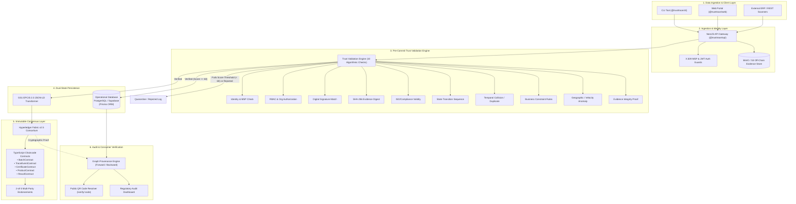

# TrustTrace (TraceTrust)

> **Trust-First, Permissioned Blockchain Architecture for Software-Based Supply Chain Traceability**

[](https://opensource.org/licenses/Apache-2.0)
[](https://www.typescriptlang.org/)
[](https://nextjs.org/)
[](https://nestjs.com/)
[](https://www.hyperledger.org/projects/fabric)
[](https://www.prisma.io/)
[](https://turbo.build/)
[](https://pnpm.io/)

---

## 📌 Executive Summary

Traditional blockchain supply chain solutions suffer from the **"Garbage In, Immutable Garbage Out"** paradox: committing fraudulent, unverified, or non-compliant claims to an immutable ledger simply makes falsehoods permanent. Furthermore, most systems demand costly physical IoT tracking hardware that is cost-prohibitive for smallholder suppliers and multi-tier networks.

**TrustTrace** resolves these challenges with a **software-first, pre-commit trust verification architecture**:
1. **Pre-Commit Trust Validation Engine**: Evaluates every event across 10 deterministic algorithmic checks (*Identity, Authorization, Signatures, Documents, Certificates, Lifecycle Sequences, Duplication, Business Rules, Anomalies, and Evidence Hash Integrity*) **before** committing anything to the distributed ledger.
2. **GS1 EPCIS 2.0 Standard Alignment**: Maps verified events into interoperable JSON-LD formats with standardized CBV (Core Business Vocabulary) steps.
3. **Consortium Governance & Smart Contracts**: Uses Hyperledger Fabric permissioned smart contracts (TypeScript Chaincode) enforcing multi-party 2-of-3 endorsement policies.
4. **Decoupled Storage Architecture**: Separates fast operational relational state (PostgreSQL / Supabase) and private commercial evidence (S3 / MinIO object storage with SHA-256 hashes) from immutable ledger state.
5. **Real-Time Provenance & Public QR Verification**: Graph-based forward and backward batch tracing with consumer-facing instant verification pages.

---

## 🏗️ System Overview & Architecture Flow



For complete deep-dive specifications, refer to [ARCHITECTURE.md](file:///d:/PCE/ARCHITECTURE.md).

---

## 📂 Monorepo Structure

TrustTrace is organized as a high-performance monorepo powered by **Turborepo** and **pnpm workspaces**:

```
.
├── apps/
│   ├── api/                   # NestJS REST API Gateway & Trust Service
│   │   ├── Dockerfile
│   │   ├── src/
│   │   │   ├── audits/        # System & transaction audit logging
│   │   │   ├── auth/          # Authentication & consortium credentials
│   │   │   ├── batches/       # Batch lifecycle management
│   │   │   ├── blockchain/    # Fabric gateway connector & submission
│   │   │   ├── certificates/  # Standards compliance & ISO certificates
│   │   │   ├── common/        # Shared Prisma client & middleware
│   │   │   ├── dashboard/     # Aggregated analytics endpoints
│   │   │   ├── disputes/      # Multi-party transaction disputes
│   │   │   ├── documents/     # Off-chain evidence metadata
│   │   │   ├── endorsements/  # 2-of-3 multi-signature verification
│   │   │   ├── events/        # Ingestion of supply chain trace events
│   │   │   ├── evidence/      # File upload & cryptographic hashing
│   │   │   ├── health/        # Liveness & readiness probes
│   │   │   ├── organizations/ # Consortium member management
│   │   │   ├── products/      # Catalog & GTIN master data
│   │   │   ├── qr-codes/      # Dynamic verification QR generation
│   │   │   ├── recalls/       # Automated graph-based batch recalls
│   │   │   ├── traceability/  # Recursive DAG provenance graph solver
│   │   │   └── trust/         # 10-point Pre-Commit Trust Engine
│   │   └── tsconfig.json
│   │
│   ├── cli/                   # Developer & Operator Command Line Interface
│   │   ├── src/
│   │   │   ├── commands/      # CLI modules (audit, auth, batch, event, recall, trace, etc.)
│   │   │   └── services/      # REST API communication client
│   │   └── package.json
│   │
│   └── web/                   # Modern Next.js 14 Web Application
│       ├── app/
│       │   ├── admin/         # Consortium administration
│       │   ├── architecture/  # Interactive system architecture visualizer
│       │   ├── audits/        # Cryptographic audit explorer
│       │   ├── batches/       # Batch registry & lifecycle inspector
│       │   ├── certificates/  # Active credentials & revocations
│       │   ├── dashboard/     # Supply chain telemetry & health
│       │   ├── disputes/      # Dispute resolution center
│       │   ├── docs/          # Interactive developer documentation
│       │   ├── events/        # Real-time event stream
│       │   ├── evidence/      # Document verification & hash checker
│       │   ├── organizations/ # Participant directory
│       │   ├── products/      # Product management
│       │   ├── recalls/       # Root-cause recall cascade visualizer
│       │   ├── research/      # Academic whitepaper & benchmarks
│       │   ├── trace/         # Visual DAG supply chain graph explorer
│       │   ├── verification/  # Operator inspection workbench
│       │   └── verify/[code]/ # Public consumer authentication page
│       ├── components/        # Reusable UI & graph components
│       └── lib/               # Typed client API SDK
│
├── packages/
│   ├── chaincode/             # Hyperledger Fabric Smart Contracts (TypeScript)
│   │   └── src/contracts/     # Batch, TraceEvent, Certificate, Product, Recall contracts
│   ├── config/                # Shared environment & config schemas
│   ├── crypto/                # SHA-256, stable payload hashing & key routines
│   ├── database/              # Prisma schema & PostgreSQL client
│   │   ├── prisma/schema.prisma
│   │   └── prisma/seed.ts
│   ├── epcis/                 # GS1 EPCIS 2.0 JSON-LD builders
│   ├── logger/                # Structured contextual logging
│   └── types/                 # Shared TypeScript interfaces & DTOs
│
├── docs/                      # Technical manuals & API specs
├── scripts/                   # Environment synchronizer & seeding tools
├── docker-compose.yml         # Container orchestration (API, Web, DB, MinIO)
├── pnpm-workspace.yaml        # Workspace configuration
└── turbo.json                 # Turbo caching & pipeline configuration
```

---

## ⚡ Quick Start & Development Setup

### Prerequisites
- **Node.js**: `v20.x` or later
- **pnpm**: `v9.x` (`npm install -g pnpm`)
- **Docker & Docker Compose** (Optional for local PostgreSQL & MinIO)

### 1. Clone the Repository
```bash
git clone https://github.com/Pranav-joshi02/TraceTrust.git
cd TraceTrust
```

### 2. Install Workspace Dependencies
```bash
pnpm install
```

### 3. Configure Environment Variables
Copy `.env.example` to `.env` in the root:
```bash
cp .env.example .env
```
Synchronize the root `.env` to all packages and apps:
```bash
pnpm run sync-env
```

*(By default, `.env.example` points to the hosted Supabase pooler or your local PostgreSQL database).*

### 4. Setup Database Schema & Seed Data
Initialize the database tables and populate mock supply chain consortium data:
```bash
pnpm run db:push
pnpm run db:seed
```

### 5. Launch the Development Environment
Run all services simultaneously with Turbo:
```bash
pnpm run dev
```

The services will become available at:
- 🌐 **Web Interface**: [http://localhost:3000](http://localhost:3000)
- 🔌 **API Gateway**: [http://localhost:4000/api](http://localhost:4000/api)
- 🔍 **Interactive Architecture Visualizer**: [http://localhost:3000/architecture](http://localhost:3000/architecture)
- 📄 **Research Whitepaper**: [http://localhost:3000/research](http://localhost:3000/research)
- 📱 **Consumer Verification Portal**: [http://localhost:3000/verify/BATCH-2026-001](http://localhost:3000/verify/BATCH-2026-001)

---

## 🖥️ Command Line Interface (CLI)

TrustTrace includes a developer and field operator CLI (`@trusttrace/cli`) built with Commander.js.

### Global Installation / Linking
```bash
cd apps/cli
pnpm link --global
```

### Key CLI Commands

| Command | Description | Example |
| :--- | :--- | :--- |
| `trusttrace auth login` | Authenticate operator with consortium credentials | `trusttrace auth login --email admin@trusttrace.io` |
| `trusttrace status` | Health status of API, Database, and Ledger | `trusttrace status` |
| `trusttrace product list` | List registered GTIN products | `trusttrace product list` |
| `trusttrace batch create` | Mint a new product batch with metadata | `trusttrace batch create --sku SKU-100 --qty 500` |
| `trusttrace event record` | Record a supply chain event (harvest, ship, receive) | `trusttrace event record --batch B-001 --type SHIPPED` |
| `trusttrace verify <code/id>` | Run 10-point trust engine checks on an event | `trusttrace verify EVT-2026-881` |
| `trusttrace trace <batch>` | Traverse forward/backward provenance DAG | `trusttrace trace BATCH-2026-001 --direction both` |
| `trusttrace recall trigger` | Trigger automated recall across downstream batches | `trusttrace recall trigger --batch B-001 --reason "Contamination"` |
| `trusttrace certificate list`| Inspect active ISO and compliance certificates | `trusttrace certificate list` |

---

## 🛡️ The 10 Pre-Commit Trust Checks

Before any event is approved or anchored on the Hyperledger Fabric ledger, the **TrustEngine** runs the following algorithmic evaluations:

```
T(E) = w_id·I(E) + w_auth·A(E) + w_sig·S(E) + w_doc·D(E) + w_cert·C(E) + w_seq·Q(E) + w_dup·U(E) + w_biz·B(E) + w_anom·N(E) + w_hash·H(E)
```

1. **Identity Check (`I`) [15 pts]**: Verifies the actor organization is registered, active, and holds valid consortium credentials.
2. **Authorization Check (`A`) [10 pts]**: Validates role-based permissions (e.g., only Logistics orgs can issue `SHIPPED` events).
3. **Cryptographic Signature (`S`) [15 pts]**: Verifies the digital signature against the canonicalized event payload hash.
4. **Document Attachment (`D`) [10 pts]**: Ensures mandatory proof documents (Bill of Lading, Lab Results) are attached.
5. **Certificate Validation (`C`) [10 pts]**: Validates that required certifications (e.g. ISO 22000, Fair Trade) are active and unexpired.
6. **Lifecycle Sequence (`Q`) [10 pts]**: Verifies that state transitions obey the state machine (e.g., cannot `RECEIVE` before `SHIPPED`).
7. **Duplicate Prevention (`U`) [10 pts]**: Prevents double-spending, replay attacks, or identical event re-submissions.
8. **Business Rule Engine (`B`) [5 pts]**: Validates quantitative constraints (e.g., output quantities cannot exceed input batch quantities).
9. **Anomaly Detection (`N`) [5 pts]**: Detects impossible travel velocities, geographic mismatches, or abnormal elapsed durations.
10. **Evidence Hash Integrity (`H`) [10 pts]**: Recalculates the SHA-256 digest of stored evidence and compares against declared hash.

*Score >= 60 and < 2 failed checks = **VERIFIED** (Eligible for Blockchain Commit)*  
*1 failed critical check = **SUSPICIOUS** (Quarantined for manual audit)*  
*> 1 failed checks = **REJECTED** (Ledger write strictly blocked)*

---

## 🧪 Testing & Code Quality

Run tests, typechecking, and linting across all workspace packages:

```bash
# Typecheck all packages
pnpm run typecheck

# Lint all packages
pnpm run lint

# Run chaincode unit tests
pnpm --filter @trusttrace/chaincode test

# Build production bundles
pnpm run build
```

---

## 📜 Academic Research & Publications

For deep theoretical foundations, mathematical formulations, and empirical benchmarks:
- **[RESEARCH.md](file:///d:/PCE/RESEARCH.md)**: Academic whitepaper explaining the trust-first architecture, IoT vs software comparisons, and performance results.
- **[ARCHITECTURE.md](file:///d:/PCE/ARCHITECTURE.md)**: System design blueprint detailing each layer, data flow, and threat model.

---

## 📄 License

This project is licensed under the **Apache License 2.0**. See the [LICENSE](file:///d:/PCE/LICENSE) file for details.
